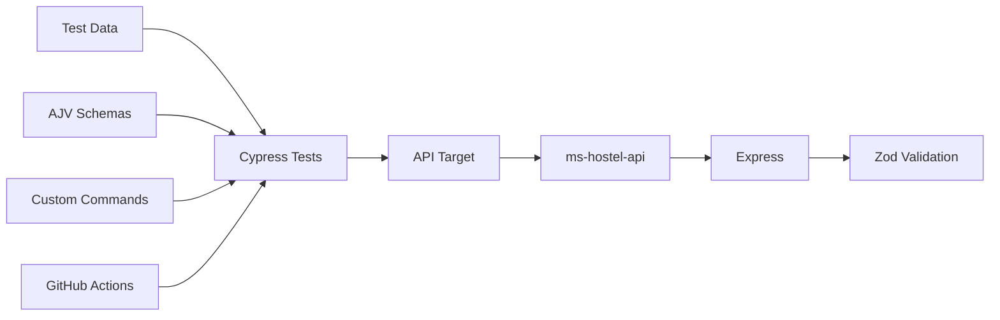

# API Testing Framework

Framework de **API test automation** construido con Cypress + TypeScript, pensado como base reutilizable para automatizar APIs y microservices.

El objetivo no es solamente ejecutar requests: el proyecto cubre validaciones funcionales, contratos de respuesta, escenarios positivos y negativos, manejo de test data, reporting y ejecución automática en CI.

## Stack

**Cypress · TypeScript · AJV · Express · Zod · OpenAPI · GitHub Actions**

- Cypress para ejecución de API tests.
- TypeScript para mantener tipado y escalabilidad.
- AJV + JSON Schema para validar response contracts.
- Express + Zod para una API mock determinística.
- OpenAPI / Swagger para documentar el servicio bajo prueba.
- Mochawesome + terminal logs para evidencia de ejecución.
- Fixture-based test data separado de la lógica de los tests.
- GitHub Actions para CI.

## Architecture



Cypress mantiene separados los **test cases**, los datos de prueba y los contratos esperados.

El `ms-hostel-api` funciona como API de referencia local y permite ejecutar la suite de manera determinística sin depender de servicios externos.

## Project structure

```text
cypress/
├── e2e/apis/          # Test specs organizados por API y resource
├── fixtures/          # Test data
├── schemas/           # Response contracts
├── support/           # Custom commands y configuración
└── types/             # Domain types

mock-server/
├── src/               # Express API
└── openapi/           # OpenAPI specification

.github/workflows/     # GitHub Actions
cypress.config.ts
```

## Current coverage

La suite actual contiene **56 automated API tests** sobre `ms-hostel-api`.

| Endpoint | Coverage |
| --- | --- |
| `GET /health` | Health check |
| `GET /api/v1/users` | Listado, filtros, búsqueda, sorting y pagination |
| `POST /api/v1/users` | Creación y validaciones |
| `GET /api/v1/users/{id}` | Consulta por ID |
| `PUT /api/v1/users/{id}` | Full update |
| `PATCH /api/v1/users/{id}` | Partial update |
| `DELETE /api/v1/users/{id}` | Eliminación |

Incluye escenarios **positive / negative**, status codes, response body, business rules y contract validation.

Con la API mock ejecutándose, la documentación Swagger está disponible en:

[http://localhost:3000/docs](http://localhost:3000/docs)

## Run locally

Requiere [**Node.js 24+**](https://nodejs.org/).

```bash
npm ci
```

Levantar la API mock:

```bash
npm run mock:start
```

En otra terminal:

```bash
npm run cy:run
```

Para ejecución interactiva:

```bash
npm run cy:open
```

También se puede ejecutar contra otra API compatible configurando `API_BASE_URL`.

## CI & Evidence

Cada `push` y `pull_request` ejecuta automáticamente:

```text
npm ci
→ TypeScript validation
→ Start mock API
→ Health check
→ Cypress API tests
→ Upload artifacts
```

GitHub Actions conserva como artifact:

```text
api-test-artifacts
```

incluyendo el **Mochawesome HTML report**, terminal logs y screenshots cuando existen.

## Design approach

El framework busca mantener una separación clara entre:

**test logic → test data → contracts → API implementation**

Los test cases data-driven reutilizan fixtures mediante `Cypress._.each`, evitando duplicar lógica entre escenarios.

Los contratos utilizados por Cypress son independientes de las validaciones Zod del mock, evitando validar una implementación contra su propia definición.

La estructura está preparada para incorporar nuevos microservices, resources y endpoints sin cambiar la arquitectura base.
